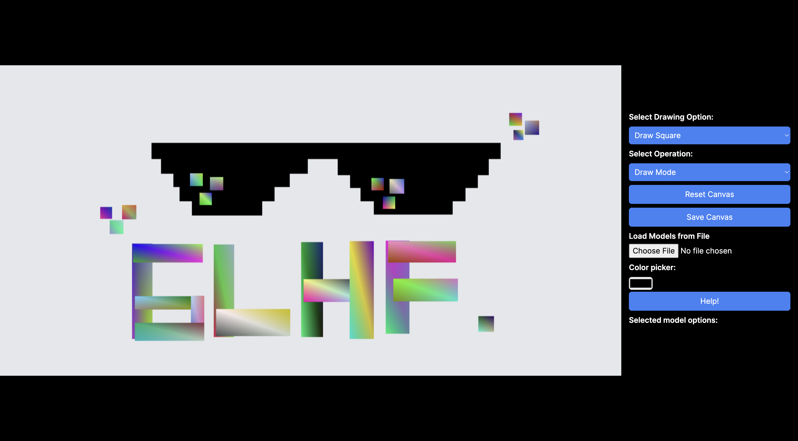

# 👾 WebGL 2D Primitives Element

<p align="center" style="border-radius: 10px; box-shadow: rgba(99, 99, 99, 0.2) 0px 2px 8px 0px;">

</p>


## 🤖 How to Run Locally

1. Clone this repository and go to src folder
2. Execute `npm i` on terminal
3. Run the development server:
```bash
npm run dev
# or
yarn dev
# or
pnpm dev
# or
bun dev
```
4. Open [http://localhost:3000](http://localhost:3000) with your browser to see the result.

### ✨ How to Use
Here are some of the functionalities of the app:

- Use the dropdowns to select the drawing option and operation mode.
- Draw shapes on the canvas by clicking and dragging.
- Select drawn objects by clicking on them.
- Perform operations like translate, rotate, or delete on selected objects.
- If a point is selected, it can be moved while preserving geometry (except for polygons).
- Change the color of selected models or points using the color picker.
- Save and reload models from files.
- Each selected object has its own properties like width/height that can be changed.

---

Made with 🫡 by WebGLHF team,
|Nama | NIM|
|--|--|
|[William Nixon]("https://github.com/williamnixon20")|13521123|
|[Nicholas Liem]("https://github.com/NicholasLiem")|13521135|
|[Made Debby Almadea P.]("https://github.com/debbyalmadea")|13521153|